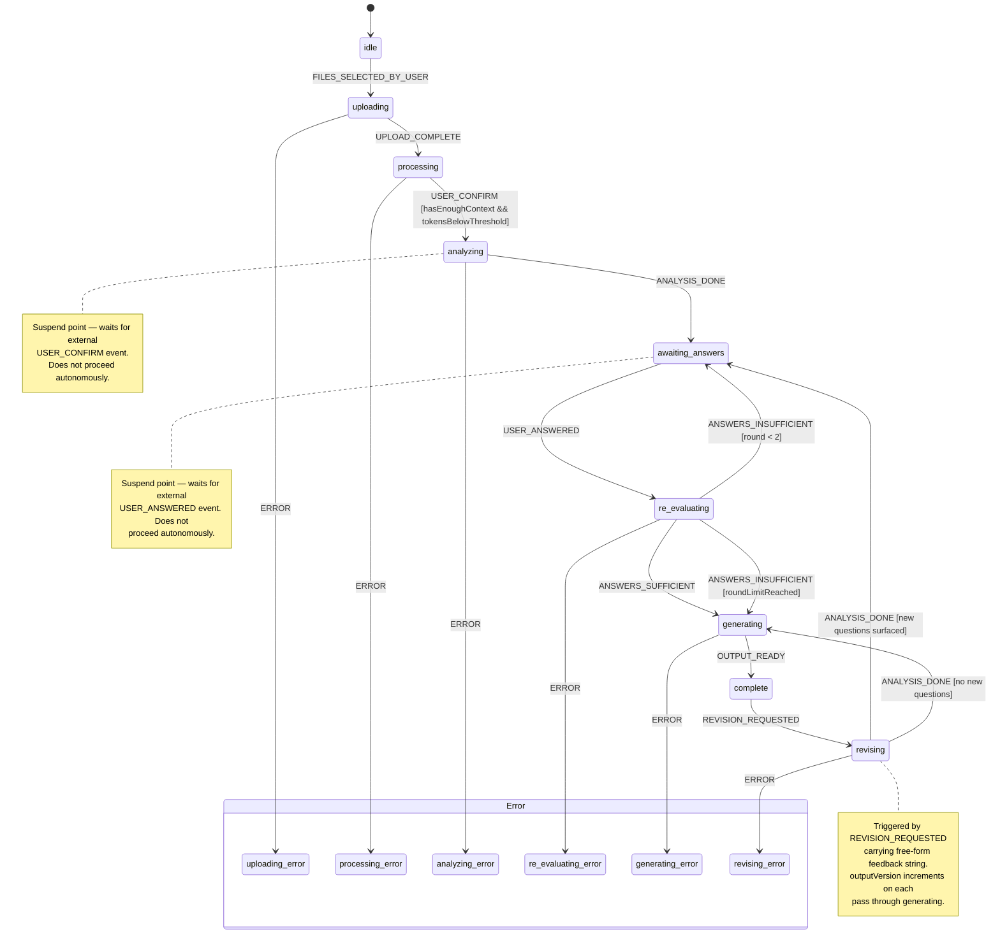

# Shipwright

An AI agent that ingests a messy bundle of project inputs — briefs, PRD drafts, RFPs, meeting transcripts — analyses them for gaps and contradictions, asks a targeted set of clarifying questions, and produces two outputs: a human-readable **Project Brief** and a coding-agent-ready **Implementation PRD**.

## Stack

| Layer                 | Technology                                           |
| --------------------- | ---------------------------------------------------- |
| API                   | Hono + Hono RPC                                      |
| Agent / Orchestration | Vercel AI SDK Core + XState                          |
| LLM                   | Claude 3.7 Sonnet (Anthropic via Vercel AI SDK)      |
| Document Processing   | unpdf + mammoth + Node.js fs                         |
| Vector DB             | PostgreSQL + pgvector + Drizzle ORM                  |
| Embeddings            | OpenAI text-embedding-3-small                        |
| File Storage          | StorageAdapter + @aws-sdk/client-s3 + rustfs (local) |
| Observability         | Langfuse                                             |

## Build progress

Session history, completed phases, decisions, and deviations are tracked in [`docs/progress.md`](docs/progress.md). Read this first when resuming work in a new session.

## Local setup

```bash
cp .env.example .env
# fill in .env values
docker compose up -d
pnpm install
pnpm db:push
pnpm dev
```

## State machine



**Machine context shape:**
`sessionId`, `documents[]`, `documentSummaries[]`, `questions[]`, `answers[]`,
`round`, `inputMode (context | retrieval)`, `agentAnalysis`, `revisionFeedback`,
`outputVersion`, `outputs{}`

Full schema: `src/shared/schemas/machine.ts`

## Processing:

````mermaid
flowchart TD
    A([User opens app]) --> B[Session created\nstored in localStorage]
    B --> C[User uploads documents\nPDF / DOCX / TXT / MD]

    C --> D[POST /api/sessions/upload-url\nreturns presigned S3 URL per file]
    D --> E[Client PUTs files directly to S3\nHono never sees file bytes]
    E --> F[POST /api/sessions/:id/confirm-upload\nBE calls HeadObject to verify]

    F --> G[XState: idle → processing\nsnapshot persisted to DB]

    G --> H[process-uploaded-documents\nEffect.forEach concurrency 2]
    H --> I[Parse from S3\nunpdf / mammoth / fs]
    I --> J[Chunk + embed\nrecursive splitter + location metadata\nOpenAI text-embedding-3-small → pgvector]
    J --> K[Store tokenCount on documents\nsummaryStatus = pending]

    K --> L[User reviews uploaded files\nconfirms ready to analyse]
    L --> M[USER_CONFIRM event\nmachine → analyzing]

    M --> N[Summarizer — loop over all docs]

    subgraph SUMMARIZE [Per-document summarization]
        N --> O[Load chunks from DB\nordered by chunkIndex]
        O --> P{Chunks fit\nin one call?}
        P -- yes --> Q[Single summarization call\nchunks → DocumentSummary]
        P -- no --> R[Map: batch N chunks\neach batch → intermediate summary]
        R --> S[Reduce: intermediates\n→ final DocumentSummary]
    end

    Q --> T[Store summary + summaryStatus=ready\non documents table]
    S --> T

    T --> U{All docs\nsummarised?}
    U -- no --> N
    U -- yes --> V[ANALYSIS_DONE\nmachine → awaiting_answers]

    V --> W[Challenger pass\nreads all per-doc summaries\n→ GapReport\nconflicts + gaps + ambiguities]

    W --> X[Question Generator\nranks gaps by impact\nselects 3–7 questions\nstored to questions table]

    X --> Y[Machine suspends\nawaiting_answers]
    Y --> Z[User reads questions\ntypes answers in UI]

    Z --> AA[POST /api/sessions/:id/answers\nUSER_ANSWERED event\nanswers persisted to DB]

    AA --> AB[machine → re_evaluating\nAre answers sufficient?]
    AB --> AC{Sufficient or\nround >= 2?}
    AC -- insufficient and round < 2 --> AD[ANSWERS_INSUFFICIENT\nnew targeted questions]
    AD --> Y
    AC -- sufficient or limit reached --> AE[ANSWERS_SUFFICIENT\nmachine → generating]

    AE --> AF[Writer Brief\nstreamText\nsummaries + answers → Project Brief\ncitations to sourceDocument]
    AE --> AG[Writer PRD\nstreamText\nsummaries + answers → Implementation PRD\nwritten for coding agent]

    AF --> AH[Store outputs table\ntype=project_brief version=1]
    AG --> AI[Store outputs table\ntype=implementation_prd version=1]

    AH --> AJ[OUTPUT_READY\nmachine → complete]
    AI --> AJ

    AJ --> AK[User downloads outputs\nGET /api/sessions/:id/output/:type/download-url\n→ presigned S3 GET URL\nshort TTL, bytes direct from S3]

    AK --> AL{User wants\nto revise?}
    AL -- no --> AM([Done])
    AL -- yes --> AN[User types free-form feedback\nPOST /api/sessions/:id/revise]

    AN --> AO[REVISION_REQUESTED event\nmachine → revising\nrevisionFeedback stored in context]

    AO --> AP[Revision Writer pass\nexisting outputs + feedback + summaries\noptional: re-RAG chunks for specific areas]

    AP --> AQ{New questions\nsurfaced?}
    AQ -- yes --> AR[machine → awaiting_answers\nnew clarifying questions]
    AR --> Y
    AQ -- no --> AS[machine → generating\nregenerate both outputs\noutputVersion increments]

    AS --> AT[Store outputs table\nversion=2 or higher]
    AT --> AJ
    ```

---

## TODO:
- rustfs requires more configuration in docker compose
  - https://docs.rustfs.com/installation/docker/#docker-compose-installation

---

11.06.2026

- [ ] refine prompts using rules from anthropic course
- [ ] refine testing corpus using rules from anthropic course - prompt evals
- [ ] concurrency works for now, but later on, we might need a real queue -
- [ ] find out if RAG was not ommited in the plan - where do we retrieve chunks? where llm is answering our questions based on the acquired knowledge

  - extractor
    - extractor is wrong - it should use DB with RAG capabilities to read and answer files.
  - ask questions to the rag
  - working memory - go through all the documents in the system and summarize the main topic or problem that we are trying to solve
  - based on the summary formulate questions (to user) that have to be asked wherever there are discrepancies inside summarized knowledge
  - save user answers (with corresponding question, preferably with corresponding related documents)


  - retrieval is programmatic
  - but could be an agent that does this agentically with Tools (query database, summarizing similar chunks)
    - this is how you read
    - this is how you write
    - analyze the documents and make sense of it all

- how do we do the loop of summarizing and finding discrepancies?
  - how to build working memory
    - graphRAG
- **optional** graph RAG
  - complicated
  -
---

03.07.2026

- [ ] consider data transfer object for db instead of raw dogging db queries in /db/queries.ts
- [ ] `agent/parsers.ts` - use `extname` from node to double check file extension (a .txt file can actually be a binary that's gonna run unexpectedly somewhere in the process)
- [ ] chunker.ts - make sure we don't split into too small chunks. what if we have very short paragraphs?
- [ ] chunker.ts - return not just list of chunks, but also metadata about those chunks, for pdf -> page number, maybe for markdown -> paragraph list, for all
  - imagine the situation that something is on one page in a very long chapter of very long paragraph, metadata needed
- [ ] content and embedding are technically the same thing
- [ ] try typing jsons in drizzle schema with $type() method on builder
- [ ] file-type -> fileTypeFromStream - connect that with downloadPartialObject
- [ ] parsing and chunking should be on a stream not on a buffer. because we might kill the server when parsing a big file, or we parse files from multiple users. we don't have the capacity. unless you have queues and you can process only 1-3 files at a time...
  - can chunking go on streams? unpdf?
  - embedChunks has to be queued or handles queueing itself?
- [ ] deleting all the documents from everything
  - background job/schedule to remove documents that are not connected to any existing session (and remove docs chunks and from bucket)
  - consider that for one of the last phases of the project - fine tuning

---

- step 1 - parsing/indexing/chunkgin
  - consider **pictures** or **text about pictures**
    - [text] either AI is guessing what's on the pictures and the content lands in the RAG
      - [description] of what's on the picture
    - [picture] or we just put picture to the RAG
      - you can semantically compare to other pictures
      - if we have to compare pictures, then it makes sense, for knowledge retrieval - doesn't make much sense

  - authentication
    - SSO with github

    - Backend sessions
      - check out frameworks
    - session cookies instead of JWT
      - opening session
      - revoking session

  - authorization
    - roles: member, admin, superadmin,
    - RBAC? ABAC etc. (read about it)
    - [policy system in effect](https://lucas-barake.github.io/building-a-composable-policy-system/)

  - upload size
    - 100MB what if multiple users do it?
      - ALBO stream FE -> BE -> S3 - jazda bez trzymanki i można zepsuć
      - ALBO presigned URLs - client -> Bucket
        - public, or session guarded

        - **background jobs** for listening for upload (we want to start processing uploaded file)
          - queues
          - pubsub
          - event bus in the simplest form


  - verify uploading files
    - [`file-type`](https://github.com/sindresorhus/file-type) is one of the libraries
    - if the mime type and the content actually match

  - chunking strategies
    - pdf
    - docx
---

- [ ] better error handling in `storage/index.ts`
- [ ] embedMany in `src/agent/embedder.ts` has a default batch limit, after which it throws,
remember for later
- [ ] `src/shared/schemas/api.ts` has some wild types. figure out the way and nomenclature of typing endpoints
  - {Resource}{Action}{Role}
  - Resource - what the endpoint operates on
  - Action - the operation (Create, Confirm, Upload)
  - Role - Request for input, Response for output

- [ ] Consider Effect-ts
  - error handling
  - type safe routes
  - mixing types between backend and frontend
  - use effect-atom on the frontend for fun
````
