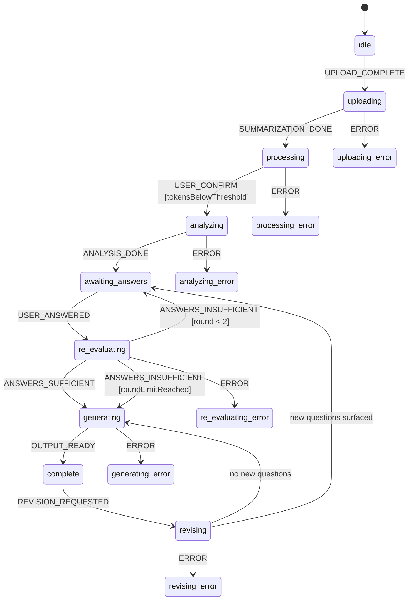

# Shipwright

AI agent that ingests messy project inputs — briefs, PRD drafts, RFPs, transcripts — analyses them for gaps and contradictions, asks a targeted set of clarifying questions, and produces two outputs: a human-readable **Project Brief** and a coding-agent-ready **Implementation PRD**.

## Stack

| Layer | Technology |
|---|---|
| Repo | pnpm workspaces — `apps/api`, `apps/web`, `packages/shared` |
| API | Effect HttpApi (`effect/unstable/httpapi`) |
| Agent / Orchestration | `@effect/ai` + XState v5 |
| LLM | Claude via `@effect/ai-anthropic` |
| Embeddings | OpenAI `text-embedding-3-small` via `@effect/ai-openai` |
| Document Processing | unpdf + mammoth + Node.js fs |
| Database | PostgreSQL + pgvector + Drizzle ORM + `@effect/sql-pg` |
| File Storage | `StorageAdapter` + `@aws-sdk/client-s3` + rustfs (local) |
| Observability | Langfuse (Phase 8) |

## Build progress

Session history, completed phases, decisions, and deviations: [`docs/progress.md`](docs/progress.md).

Current status: **Phases 1–7 + Phase 9 complete. Phase 8 (Evals) next.**

## Local setup

```bash
# 1. Infra
docker compose up -d

# 2. Install workspace deps
pnpm install

# 3. App env (API)
cp apps/api/.env.example apps/api/.env
# fill in OPENAI_API_KEY and ANTHROPIC_API_KEY

# 4. Apply DB schema
pnpm --filter @shipwright/api db:push

# 5. Start
pnpm dev                          # both api + web (concurrently)
pnpm --filter @shipwright/api start   # api only
pnpm --filter @shipwright/web dev     # web only
```

**Env file split:**
- `.env` — infra vars for docker-compose (`POSTGRES_*`, `RUSTFS_*`)
- `apps/api/.env` — server vars (`DATABASE_URL`, `S3_*`, `OPENAI_API_KEY`, `ANTHROPIC_API_KEY`)
- `apps/web/.env` — frontend vars (`VITE_API_URL`)

## Workspace layout

```
apps/
  api/              Effect HttpApi server, agent pipeline, DB, storage
    src/
      server/       handlers.ts, server.ts
      agent/        summarizer, challenger, question-generator, writers
        tests/      gate tests (phase4, phase5, phase5b, corpus)
      db/           schema.ts, queries.ts (DatabaseService), index.ts
      storage/      StorageAdapter (Effect Context.Service)
      config/       ConfigService
    drizzle.config.ts
  web/              React SPA (Phase 10 — scaffold only)
packages/
  shared/           HttpApi definition, HTTP schemas, domain errors
    src/
      api/          api.ts — HttpApi + HttpApiGroup (imported by both apps)
      schemas/      api.ts, machine.ts
      domain/       errors.ts
```

## Agent pipeline

```
Upload → HeadObject verify → parse → chunk → embed → pgvector
  → USER_CONFIRM
  → Summarizer (map-reduce per document → document_summaries table)
  → Challenger (cross-document gap report)
  → Question Generator (3–7 targeted questions)
  → [HITL suspend — awaiting_answers]
  → USER_ANSWERED → sufficiency check → loop or proceed
  → Writer Brief + Writer PRD (streamText, prompt caching)
  → outputs table + S3
  → [complete]
  → optional: REVISION_REQUESTED → Revision Writer → version++
```

## State machine



Machine context: `sessionId`, `documents[]`, `documentSummaries[]`, `questions[]`, `answers[]`, `round`, `inputMode (context | retrieval)`, `agentAnalysis`, `revisionFeedback`, `outputVersion`, `outputs{}`

Schema: `packages/shared/src/schemas/machine.ts`

## API

OpenAPI schema: `GET http://localhost:3000/openapi.json`  
Scalar docs UI: `GET http://localhost:3000/docs`

| Method | Path | Description |
|---|---|---|
| POST | `/api/sessions/upload-url` | Generate presigned S3 PUT URLs, create session |
| POST | `/api/sessions/:id/confirm-upload` | Verify upload via HeadObject |
| POST | `/api/sessions/:id/confirm` | Trigger analysis pipeline |
| GET | `/api/sessions/:id` | Session status + questions |
| POST | `/api/sessions/:id/answers` | Submit clarifying answers |
| GET | `/api/sessions/:id/output` | Retrieve generated outputs |
| GET | `/api/sessions/:id/output/:type/download-url` | Presigned S3 GET URL |
| POST | `/api/sessions/:id/revise` | Submit revision feedback |

## Gate tests

```bash
pnpm --filter @shipwright/api test:phase4   # 16 checks — clarifying loop
pnpm --filter @shipwright/api test:phase5   # writer passes
pnpm --filter @shipwright/api test:phase5b  # export + revision
pnpm --filter @shipwright/api test:corpus   # 5-doc corpus, 5/5 planted issues
```
