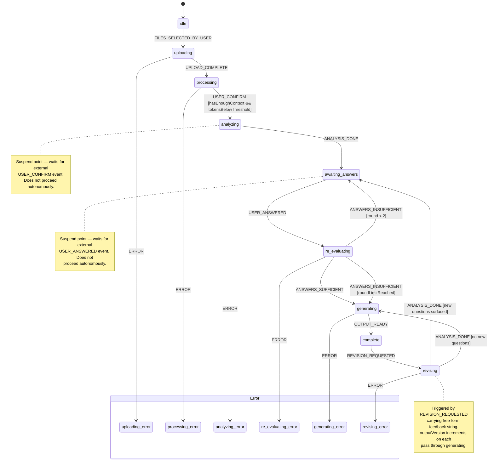

# Shipwright

An AI agent that ingests a messy bundle of project inputs — briefs, PRD drafts, RFPs, meeting transcripts — analyses them for gaps and contradictions, asks a targeted set of clarifying questions, and produces two outputs: a human-readable **Project Brief** and a coding-agent-ready **Implementation PRD**.

## Stack

| Layer | Technology |
|---|---|
| API | Hono + Hono RPC |
| Agent / Orchestration | Vercel AI SDK Core + XState |
| LLM | Claude 3.7 Sonnet (Anthropic via Vercel AI SDK) |
| Document Processing | unpdf + mammoth + Node.js fs |
| Vector DB | PostgreSQL + pgvector + Drizzle ORM |
| Embeddings | OpenAI text-embedding-3-small |
| File Storage | StorageAdapter + @aws-sdk/client-s3 + rustfs (local) |
| Observability | Langfuse |

## Build progress

Session history, completed phases, decisions, and deviations are tracked in [`docs/progress.md`](docs/progress.md). Read this first when resuming work in a new session.

## Local setup

```bash
cp .env.example .env
# fill in .env values
docker compose up -d
pnpm install
pnpm db:push
pnpm dev
```

## State machine



**Machine context shape:**
`sessionId`, `documents[]`, `documentSummaries[]`, `questions[]`, `answers[]`,
`round`, `inputMode (context | retrieval)`, `agentAnalysis`, `revisionFeedback`,
`outputVersion`, `outputs{}`

Full schema: `src/shared/schemas/machine.ts`
